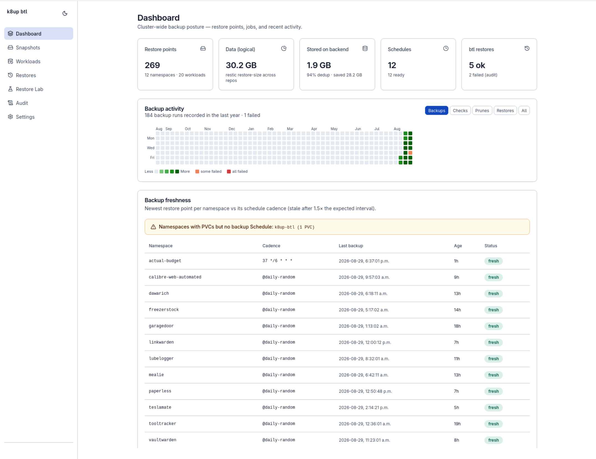
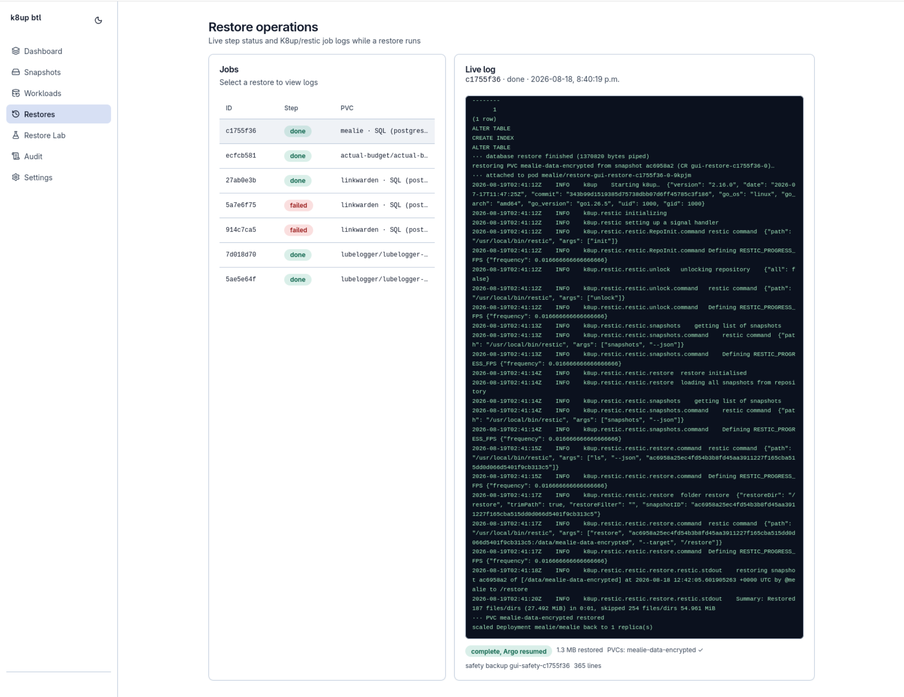
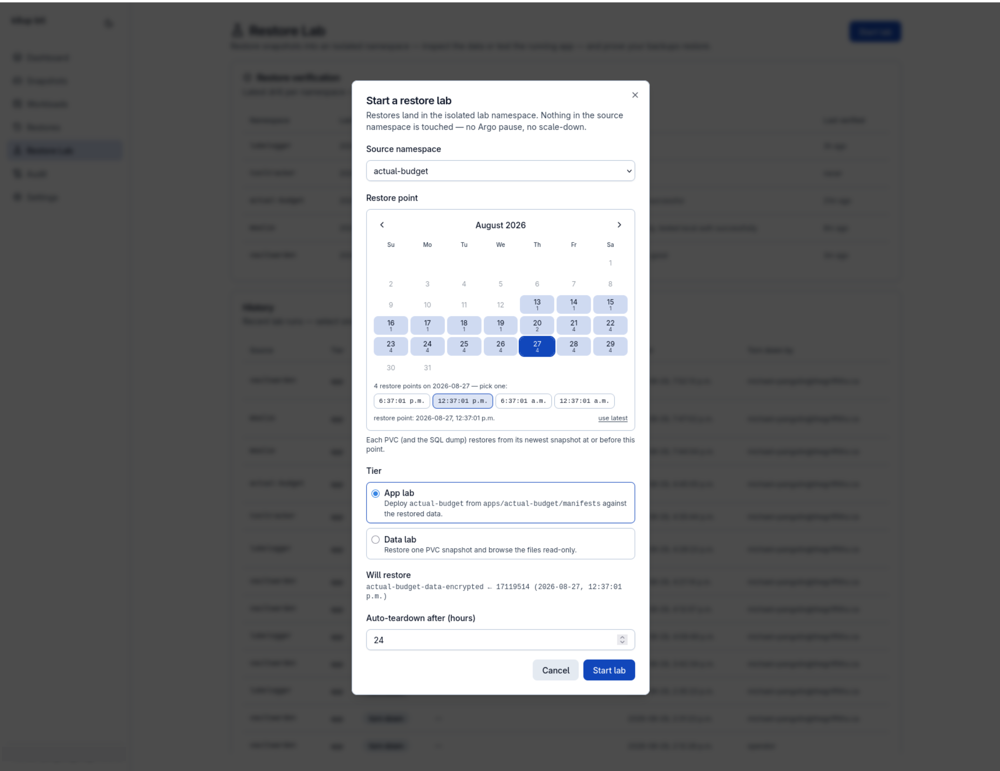
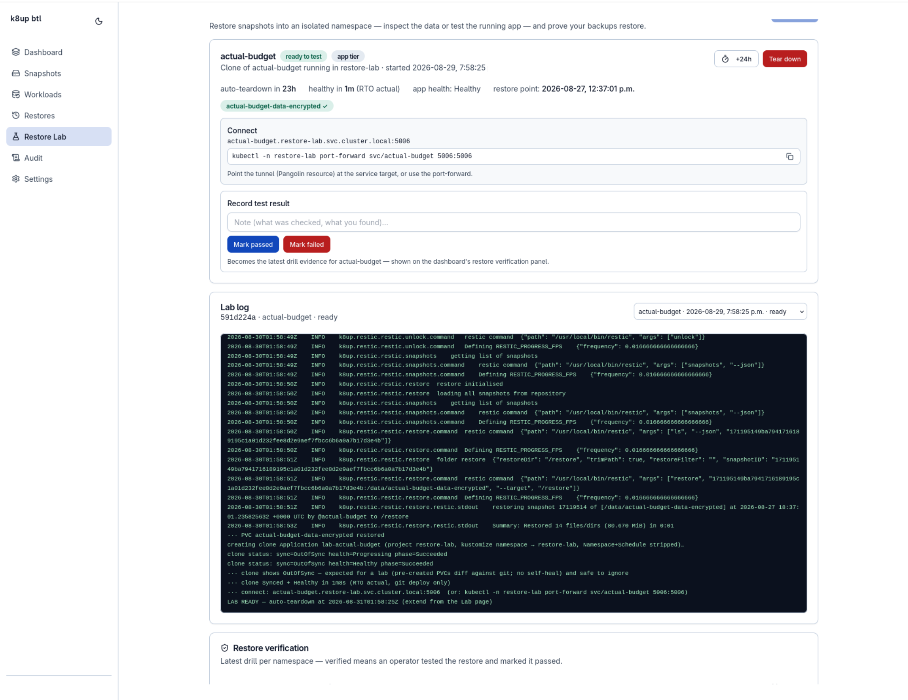

# k8up btl (ketchup bottle)

A web UI for [K8up](https://k8up.io/) on Argo CD–managed clusters: see your whole backup
posture at a glance, restore with one click, and **prove** your backups actually restore.



## Features

- **Dashboard** — restore points, dedup stats, backup activity heatmap, and per-namespace
  freshness vs schedule cadence, with a warning for namespaces that have PVCs but no Schedule.
- **One-click restores** — server-side orchestration of the whole Argo dance
  (pause sync → scale down → Restore CR → scale up → resume sync), with durable mid-restore
  state, live restic logs, progress, and cancel. Restore targets are locked to the PVC a
  snapshot was taken from.
- **SQL point-in-time recovery** — for `.sql` dump snapshots: quiesce the app, take a safety
  backup, pipe the dump into the database pod via a git-declared command.
- **Browse & compare** — read-only file tree per snapshot, file/folder downloads, and
  `restic diff` between any two snapshots.
- **Live job console** — streamed pod logs and a restic progress bar for any running
  Backup/Restore/Check/Prune, plus ad-hoc Backup/Check runs that inherit the namespace Schedule.
- **Notifications & audit** — ntfy + email alerts for job failures and restore outcomes;
  filterable 90-day audit history with CSV export.



## Restore Lab

Backups you haven't restored are a hope, not a plan. The Restore Lab restores snapshots into
an isolated, network-locked namespace — without touching the source app — so you can test them:

- **Data tier**: restore one PVC and browse the files read-only.
- **App tier**: deploy the app's git manifests against the restored data (SQL dump replayed
  into the clone's database), then poke at the running clone.

Pick a restore point from the calendar, and the lab shows exactly which snapshots will be
used before anything runs. When the clone is up you get connect endpoints, the actual RTO,
and a pass/fail verdict form — only an operator-passed test marks a namespace **verified**
on the dashboard. Labs auto-tear-down (PVCs and retained PVs included) after a TTL.





See [`docs/restore-lab.md`](docs/restore-lab.md) for the isolation model and per-app setup.

## Install

Published image: **`ghcr.io/d-kholin/k8up-btl`** (amd64/arm64). Manifests live in
[`deploy/k8s/`](deploy/k8s/); the Restore Lab scaffolding is a separate optional overlay in
[`deploy/k8s/restore-lab/`](deploy/k8s/restore-lab/).

```bash
kubectl apply -k deploy/k8s
```

For GitOps, consume `deploy/k8s` as a kustomize remote base pinned to a release tag, and bump
the `?ref=` and image tag together:

```yaml
resources:
  - https://github.com/d-kholin/k8up-btl//deploy/k8s?ref=vX.Y.Z
images:
  - name: ghcr.io/d-kholin/k8up-btl
    newTag: "X.Y.Z"
```

Adding it to an existing K8up cluster (network policy, restic credentials, Argo CD namespace,
forward-auth headers): [`docs/getting-started.md`](docs/getting-started.md). Full deployment
reference and configuration env vars: [`docs/deploy.md`](docs/deploy.md).

## Architecture

```
Browser (SPA) ──REST/SSE──▶ Go backend ──client-go──▶ K8s API
                                │                      ├─ K8up CRDs
                                │                      ├─ Deployments/STS, Pods, PVCs
                                │                      ├─ Argo CD Application CRs
                                │                      └─ Secrets (restic creds)
                                └──restic subprocess──▶ S3 repos
```

All Kubernetes, Argo, and restic access is server-side; the browser never sees credentials.
Auth is forward-auth headers behind your reverse proxy — there is no in-app login.

## Development

```bash
# backend (:8080)
cd backend && go run ./cmd/server

# frontend (proxies /api to :8080)
cd frontend && npm install && npm run dev
```

Point the backend at a cluster with `KUBECONFIG`, or run it in-cluster. SQLite (audit log,
lab state, settings) lives at `AUDIT_DB_PATH`.

## License

Private / homelab — adjust before publishing.
